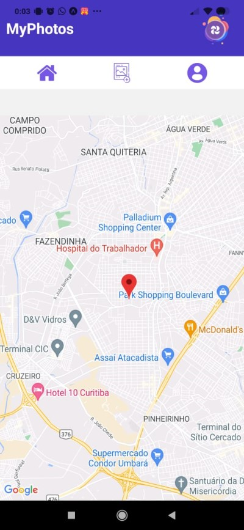
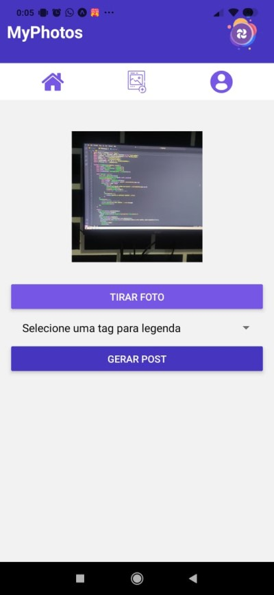

# MyPhotos - Plataforma de Compartilhamento de Posts

MyPhotos é um aplicativo de compartilhamento de fotos e frases onde os usuários podem criar posts e compartilhar com uns com outros usuários. É uma plataforma social simples desenvolvida para fins de estudos durante a materia de desenvolvimento mobile II no curso de BSI na UNISANTACRUZ.

## Funcionalidades

- Criação de posts com imagens e texto.
- Post de texto é gerado automatico com a [quotable API](https://github.com/lukePeavey/quotable)
- Feed de notícias para ver os posts de outros usuários.
- Perfil de usuário com posts.

## Ambiente de Desenvolvimento

Se você deseja contribuir para o desenvolvimento do MyPhotos, siga estas etapas:

1. Clone o repositório: 
```bash
git clone https://github.com/LucasDoGit/MyPhotos.git
cd myphotos
```
2. Instale as dependências: 
```bash
npm install
```
3. crie um projeto no firebase para armazenar os dados do aplicativo e usar o servico de autenticação. Para integrar o projeto em react-native é necessários usar a opção "*App da Web*".
4. configure o arquivo *firebase.js* para conectar ao firebase.
> após configurar criar o projeto web você recebe um parecido com o abaixo para integrar no seu código. Exemplo:
> as regras do aplicativo ainda estão sendo criadas, pois não foi finalizado. Então libere a escrita e leitura para executar o aplicativo.
```javascript
const firebaseConfig = {
  apiKey: "AIzaSDCjcwfdjgjfyfXFK7Qussu1ZBcA1zzNM",
  authDomain: "projeto-myphotos.firebaseapp.com",
  projectId: "projeto-myphotos",
  storageBucket: "projeto-myphotos.appspot.com",
  messagingSenderId: "156283934319",
  appId: "1:15678344309:web:605t79dvb377ed618c4e3c",
  measurementId: "G-FCN8Y219P8",
  databaseURL: "https://projeto-myphotos-default-abcd.firebaseio.com" // url do RealTimeDatabase
};
```
5. Inicie o aplicativo
```bash
npx expo start
```
6. Recomendo utilizar algum smartphone Android com o aplicativo "Expo GO" para executar o aplicativo.

## Snapshots

Aqui estão alguns snapshots da interface do usuário do MyPhotos:

  

## Contribuindo

Sinta-se à vontade para contribuir para o desenvolvimento do MyPhotos.

## Licença

Este projeto é licenciado sob a Licença MIT. Consulte o arquivo LICENSE.md para obter detalhes.

## Contato

Para obter mais informações, entre em contato conosco em:

- Email: lucas.saiz19@gmail.com
- GitHub: https://github.com/LucasDoGit/MyPhotos.git

Obrigado por usar o MyPhotos!

asdasd

